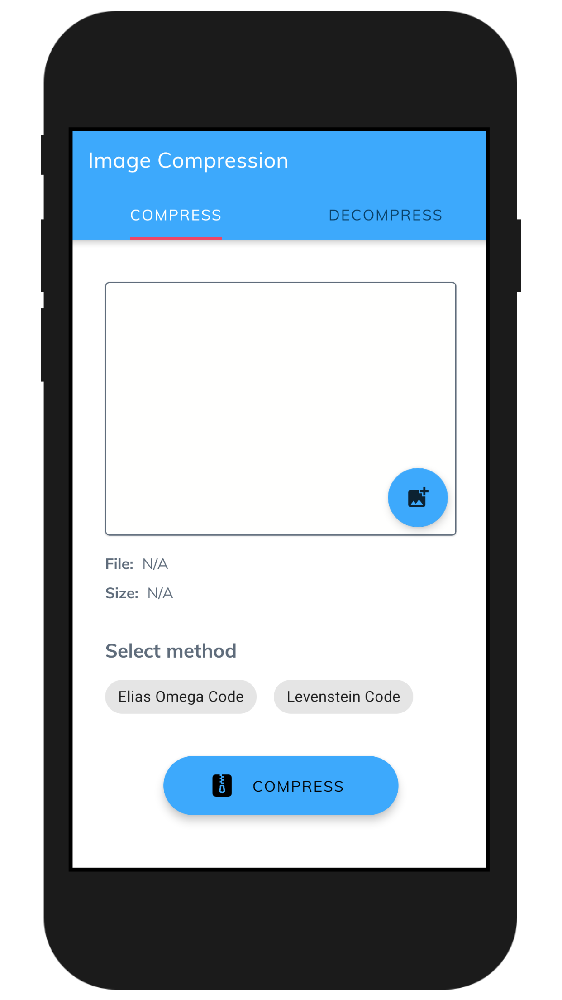
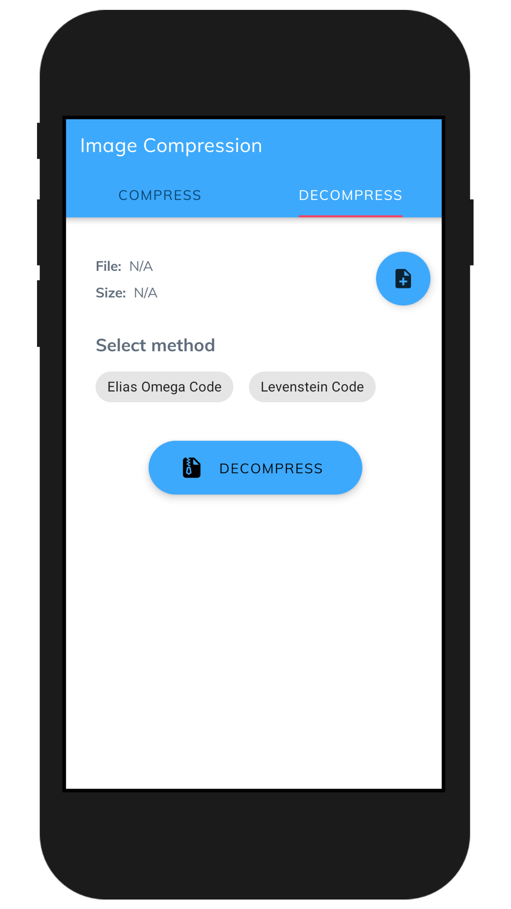
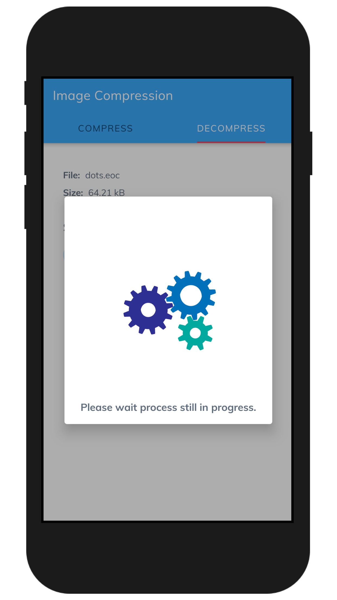
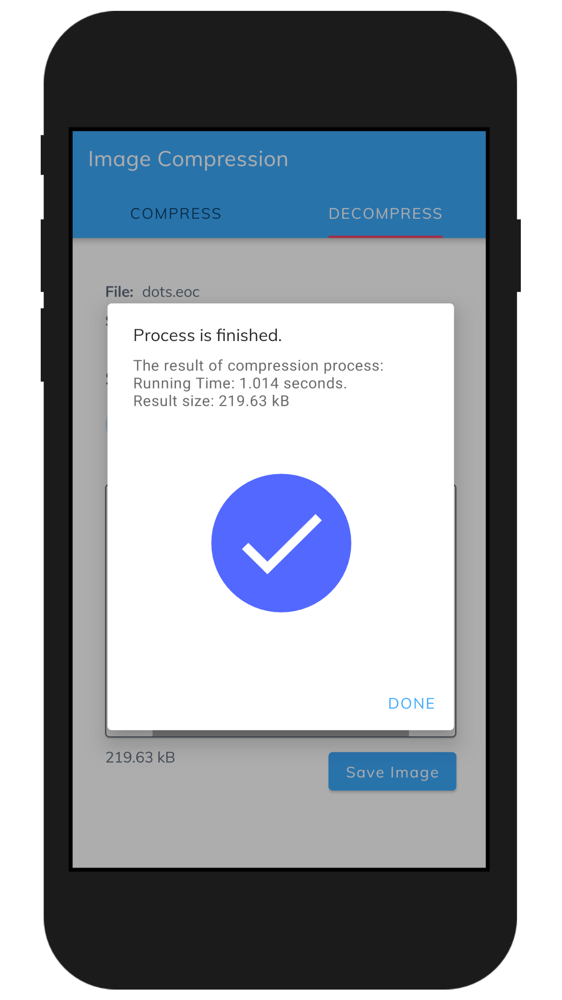
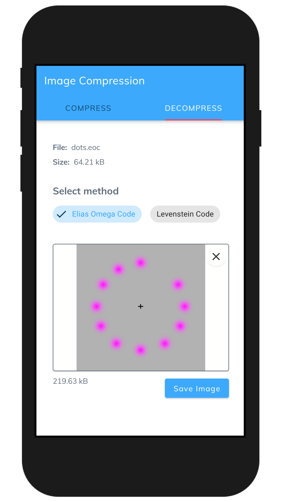

# Image Compression

An android application that can compress your images with Elias Omega Code algorithm and Levenstein Code algorithm. This application is made to compare both algorithms. For more details, you can read about this research here (soon).

## Screenshot

